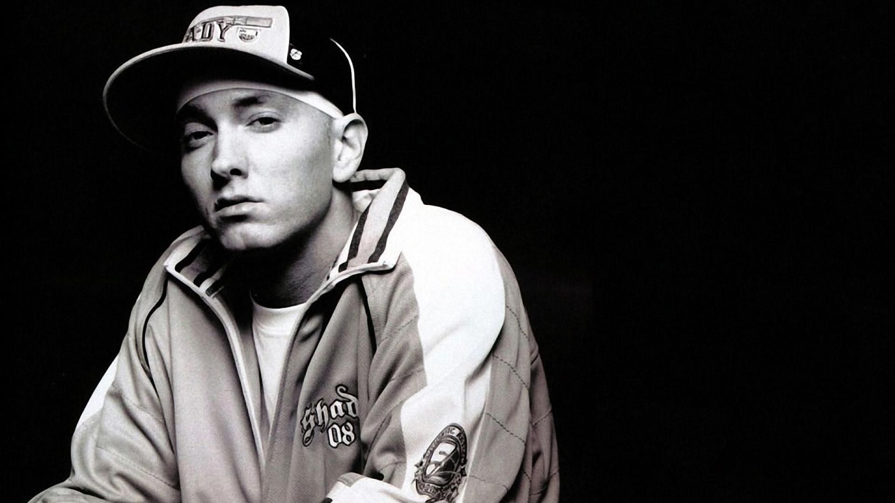

```{r setup, include=FALSE}
knitr::opts_chunk$set(echo = TRUE)
```



## Part 0: Introduction
Among all types of genres in music, Hip-Hop is one of the most distinctive in terms of lyrics. Stylized rthmic music with rapping, Hip-Hop is not only a style of music, but also a pactice reflecting the subculture in the whole society and an attitude towards life. Unlike other genres of music, the lyrics in the Hip-Hop songs are more like a rhythmic talking, thus it is quite interesting to explore the lyrics of Hip-Hop music deeply by statistical methods. 

In this project, we will carry out an exploratory data analysis focusing on the lyrics of Hip-Hop music. To be specifical, we want to answer the following three questions:

+ What exactly are the Hip-Hop artists singing?
+ What emotions do hip hop mainly express?
+ Have these emotions changed over time?

To approach the answer to these questions, we will apply the following statistical techniques in R:

+ Text Ming and Visualization
+ Sentiment Analysis
+ Topic Modeling

## Part 1: Load the Related Packages and Data

First and foremost, we loaded the necessary R packages in this project.

```{r, message=FALSE, warning=FALSE}
#load the packages
library(tm)
library(data.table)
library(DT)
library(wordcloud2)
library(RColorBrewer)
library(dplyr)
library(tidytext)
library(tidyverse)
library(rvest)
library(tibble)
library(syuzhet)
library(sentimentr)
library(gplots)
library(factoextra)
library(beeswarm)
library(scales)
library(RANN)
library(topicmodels)
library(stringr)
library(qdap)
library(tibble)
library(reshape2)
library(plotrix)
library(heatmaply)
library(ggpubr)

my_theme <-theme(plot.title = element_text(hjust = 0.5), plot.subtitle = element_text(hjust = 0.5))
my_color <- c( "#D55E00","#56B4E9",  "#CC79A7", "#009E73","#E69F00")
```

There are some notes about the data processing. I double checked the removed words and didn't remove some of the dirty words in the text processing. This is becasue there words are important elements in the Hip-Hop lyrics. We load the processed data directly and processed the loaded data again for later use.  Also, we customized the theme and color for the subsequent visualization.

```{r, message=FALSE, warning=FALSE}
load('../output/processed_lyrics_rap.RData')
artists <- read.csv('../data/artists.csv')
top500 <- read.csv('../data/polls.csv')
rap_ori <- dt_lyrics %>% dplyr::filter(genre == "Hip-Hop") 
rap <- rap_ori %>% mutate(
    decade = 
           ifelse(rap_ori$year %in% 1978:1979, "1970s", 
           ifelse(rap_ori$year %in% 1980:1989, "1980s", 
           ifelse(rap_ori$year %in% 1990:1999, "1990s", 
           ifelse(rap_ori$year %in% 2000:2009, "2000s", 
           ifelse(rap_ori$year %in% 2010:2015, "2010s", 
                  "NA")))))
  )
rap$wordlength <- word_count(rap$lyrics)
words_all <- rap %>% mutate(term = str_split(stemmedwords, ' ')) %>% 
  unnest(cols = c(term))
words_all_count <- words_all %>% count(term, name = "count") %>% arrange(desc(count))
```


## Part 2: Components of Hip-Hop Lyrics
In this part, we applied some text mining techniques to figure out the first questions: What exactly are the Hip-Hop artists singing? Firstly, we explored the whole Hip-Hop lyrics and draw a word-cloud as well as a top-ten popular word bar chart to visualize the frequency of words.

```{r, message=FALSE, warning=FALSE}
wordcloud2(words_all_count[1:300, ], size = 0.8, shape = 'circle',color = "skyblue", backgroundColor="black")
```

```{r,message=FALSE, warning=FALSE}
popular_words_top_ten <- words_all_count[1:10,] %>% mutate(term = fct_reorder(term, count))  
fig_top_ten <- ggplot(popular_words_top_ten)+geom_col(aes(x = term, y =count), fill = my_color[2]) + labs(title = "Top Ten Frequency Words in Hip-Hop Songs",x = NULL, y = "count") + my_theme + coord_flip() + theme(panel.grid.major = element_blank(),  legend.position = "none")
fig_top_ten
```

From the word-cloud and the top ten frequency words chart in Hip-Hop songs, it is obverse to find out that Hip-hop lyrics are still full of swear words. This is because Hip-Hop music originated mainly from the area full of poverty, violence and crime and the realism is one of the base of Hip-Hop music. This also makes Hip-Hop music difficult to relate with elegant places. However, besides these unsightly words, we can also find that love, life, hope can be seem among the lyrics. Although the rapper are keen on attacking the hardships of the society, they are not yield to fate. The core of the Hip-Hop music is always peace and love.

## Part 3: A Rapper's Favourite
This part is for fun. With the analyis of the word frequencey, we can also explore some interesting facts, namely, a rapper's favourite. Since the lyrics in the Hip-Hop songs are like a rhythmic talking, it is also a reflection of reality. What's rappers' favourite car? What do rappers drink? 
When rappers are high, what drugs are they tend to use. With a list of potential answers, we may find some unexpected facts.

```{r, message=FALSE,warning=FALSE }
car <- c("audi","bmw","bentley","buick", "bugatti","cadillac","chrysler",
         "citroen","chevrolet","dodge","ferrari","ford","tesla","honda",
         "hyundai","hummer","jaguar","jeep","lexus","lincoln","lamborghini",
         "mercedes","benz","maserati","maybach","mini","nissan")
car <- tibble(car = car)
rap_car <- words_all_count %>% right_join(car, by=c("term" = "car")) %>% drop_na() %>% arrange(desc(count)) 
rap_car_top_10 <- rap_car[1:10,] %>% mutate(term = fct_reorder(term, count))
fig_car <- ggplot(rap_car_top_10) + geom_col(aes(x = term, y =count), fill = my_color[3]) + coord_flip() + labs(title = "Rappers' favourite Cars", x="",y ="")+ my_theme
fig_car
```

Benz is being mentioned the most times. In fact, many rappers also use Mercedes, which means Mercedes are mentioned far ahead the other cars. However, BMW, doesn't even enter the top ten. But there may be a reason for this, the pronunciation of BMW does not fit the melody of rap, while Benz sounds more rhyme, thus being mentioned more frequently. There are not so many luxury cars in the top ten. Off-road vehicles like dodge, jeep, hummer are more common, this also reflects rappers' pursuit of freedom to some extent.

```{r,message=FALSE,warning=FALSE}
wine <- c("martell","hennessy","remymartin","vodka","chivas","bacardi",
          "smirnoff","jackdaniels","ballantine","gin","whisky","brandy",
          "rum","tequila","cocktail","beer","champagne")
wine <- tibble(wine = wine)
rap_wine  <- words_all_count %>% right_join(wine, by=c("term" = "wine")) %>% drop_na() %>% arrange(desc(count)) 
rap_wine_top_10 <- rap_wine[1:10,] %>% mutate(term = fct_reorder(term, count))
fig_wine <- ggplot(rap_wine_top_10) + geom_col(aes(x = term, y =count), fill = my_color[1]) + coord_flip() + labs(title = "Rappers' favourite Wine", x="",y ="")+ my_theme
fig_wine

```

When it comes to wine, beer turns to be most frequently mentioned, next is champagne and gin. Rappers doesn't like whisky very much, but they like spirits like vodka. Champagne is often mentioned as a symbol of wealth.

```{r,message=FALSE,warning=FALSE}
drug <- c("adderall","lsd","weed","marijuana","cannabis","cocaine",
          "heroin","morphine","opium","amphetamine","ecstasy","molly",
          "marijuana","oxycontin"
          )
drug <- tibble(drug=drug)
rap_drug  <- words_all_count %>% right_join(drug, by=c("term" = "drug")) %>% drop_na() %>% arrange(desc(count)) 
rap_drug_top_10 <- rap_drug[1:10,] %>% mutate(term = fct_reorder(term, count))
fig_drug <- ggplot(rap_drug_top_10) + geom_col(aes(x = term, y =count), fill = my_color[4]) + coord_flip()+ labs(title = "Rappers' favourite Drug", x="",y ="")+ my_theme
fig_drug
```

Since weed as well as marijuana and cannabis is legal in some states, it is reasonable to be mentioned most frequently. Cocaine is a synonymous with related to traditional drugs, therefore it is understandable why it is often mentioned.
What we need to be alert here is that some new drugs, like molly, which has been mentioned most frequently followed by weed and cocaine. 

Here, The reason we do data analysis on drugs is to remind people that there are some dark sides in hip-hop music. The genre od music are not excuses, we are always against violence and crime. Again, the core of the Hip-Hop music, is always peace and love.

## Part 4: Changing of the Hip-Hop over the years
In this part, we will pay attention to the changes of hip hop music over time. Here we first count the changes in high-frequency words of hip-hop music in each era. Then we also counted the changes in the length of the lyrics of hip hop music in each era. These are mainly to prepare for the next part, sentiment analysis and topic modeling.

```{r,message=FALSE,warning=FALSE}
timeless_words <- words_all %>% filter(decade != "NA") %>%
  group_by(decade) %>% count(term, decade, sort  =T) %>%
  slice(seq_len(10))%>% ungroup() %>% arrange(decade,n) %>% mutate(row = row_number())

fig_timeless <- ggplot(data = timeless_words, aes(row, n, fill = decade))+
  geom_col(show.legend = F) + labs(x = NULL, y = "Song Count") +
  facet_wrap(~decade, scales = "free", ncol = 4) + scale_x_continuous(
    breaks = timeless_words$row,
    labels = timeless_words$term
  ) + coord_flip() + my_theme
fig_timeless
```

By comparing with the timeless words,we can find out that high-frequency words are relatively fixed in Hip-Hop music of different decades. But it's worth noticing that the swear words in hip-hop music are popular in recent years. From this, we can vaguely feel that hip-hop music is more negative than before. 

```{r,message=FALSE,warning=FALSE}
rap_decade <- rap %>% filter(decade != "NA") 
rap_decade$decade <- factor(rap_decade$decade)
rap_decade$decadereordered <- reorder(rap_decade$decade, rap_decade$wordlength, mean, order = T)

fig_wordlength <- beeswarm(wordlength~decade, 
         data=rap_decade,
         horizontal = T, 
         pch=16, col=alpha(brewer.pal(9, "Set1"), 0.6), 
         cex=0.55, cex.axis=0.8, cex.lab=0.8,
         spacing=0.5/nlevels(rap_decade$decadereordered),
         las=2, xlab="Number of words in a song.", ylab="",
         main="Lyric length in Hip-Hop Music")
```

By comparing the length of hip-hop lyrics in different decades, we did not find a big change pattern. However, we can still find that the millennium was the era of high-yielding hip-hop music, and the production of hip-hop music declined in the following decade.

## Part 5: Sentiment Analysis of Hip-Pop Music
In this part, we applied sentiment analysis to solve second question: What emotions do Hip-Hop mainly express? We firstly performed sentiment analysis on all Hip-Hop music lyrics in the existing data, then clustered and visualized the analyzed data. Next we performed sentiment analysis on Hip-Hop songs of different decades to find the changes in the emotions of Hip-Hop music.

```{r,message=FALSE,warning=FALSE}
rap_full <- rap %>% filter(decade != "NA")
rap_sentiment <-  get_nrc_sentiment(rap_full$lyrics)
rap_lyrics_sentiment <- rap_full %>% cbind(rap_sentiment) %>%
  mutate(anger = anger/wordlength, anticipation = anticipation/wordlength, disgust = disgust/wordlength, fear = fear/wordlength, joy = joy/wordlength, sadness = sadness/wordlength, surprise = surprise/wordlength, trust = trust/wordlength, negative = negative/wordlength, positive = positive/wordlength) 

emo.means=colMeans(select(rap_lyrics_sentiment, anger:trust)>0.01)
col.use=c("red2", "darkgoldenrod1", 
            "chartreuse3", "blueviolet",
            "darkgoldenrod2", "dodgerblue3", 
            "darkgoldenrod1", "darkgoldenrod1")
barplot(emo.means[order(emo.means)], las=2, col=col.use[order(emo.means)], horiz=T, main="Sentiment Analysis of Hip-Hop lyrics of All Time")
```

By performing sentiment analysis on hip-hop music in all data, we can find that hip-hop music transmits more than the negative emotions generated by swear words. Trust is a very important keyword. But in general, hip-hop is still dominated by negative emotions. Hip-hop music originates from the bottom people who often face discrimination, violence and crime. Therefore, hip hop music has become a window for them to express their inner anger, pain and helplessness. This also makes the hip-hop music full of anxiety, anger and fear.

```{r,message=FALSE,warning=FALSE}
heatmap.2(cor(rap_lyrics_sentiment%>%select(anger:trust)), 
          scale = "none", 
          col = bluered(100),  margin=c(6, 6), key=F,
          trace = "none", density.info = "none")
par(mar=c(4, 6, 2, 1))
```

We can find that the 8 emotions are divided into 2 groups, the first group is fear, anger, sadness, disgust and the second group is anticipation, trust, joy and surprise. This clustering meet our expections and illustrates the emotions the artists want to express in the hip hop music: Though they are dissatisfied with the real word, there still exists a hint of hope and expections.

```{r,message=FALSE,warning=FALSE}
par(mar = c(3, 6, 2, 1))
par(mfrow = c(2,2))

## sentiment analyis of rap in 80s
rap_lyrics_sentiment_80 <- rap_lyrics_sentiment %>% filter(decade == "1980s")
emo.means=colMeans(select(rap_lyrics_sentiment_80, anger:trust)>0.01)
col.use=c("red2", "darkgoldenrod1", 
            "chartreuse3", "blueviolet",
            "darkgoldenrod2", "dodgerblue3", 
            "darkgoldenrod1", "darkgoldenrod1")
barplot(emo.means[order(emo.means)], las=2, col=col.use[order(emo.means)], horiz=T, main="Sentiment of Hip-Hop in 1980s")

## sentiment analyis of rap in 90s
rap_lyrics_sentiment_90 <- rap_lyrics_sentiment %>% filter(decade == "1990s")
emo.means=colMeans(select(rap_lyrics_sentiment_90, anger:trust)>0.01)
col.use=c("red2", "darkgoldenrod1", 
            "chartreuse3", "blueviolet",
            "darkgoldenrod2", "dodgerblue3", 
            "darkgoldenrod1", "darkgoldenrod1")
barplot(emo.means[order(emo.means)], las=2, col=col.use[order(emo.means)], horiz=T, main="Sentiment of Hip-Hop in 1990s")

## sentiment analyis of rap in 00s
rap_lyrics_sentiment_00 <- rap_lyrics_sentiment %>% filter(decade == "2000s")
emo.means=colMeans(select(rap_lyrics_sentiment_00, anger:trust)>0.01)
col.use=c("red2", "darkgoldenrod1", 
            "chartreuse3", "blueviolet",
            "darkgoldenrod2", "dodgerblue3", 
            "darkgoldenrod1", "darkgoldenrod1")
barplot(emo.means[order(emo.means)], las=2, col=col.use[order(emo.means)], horiz=T, main="Sentiment of Hip-Hop in 2000s")

## sentiment analyis of rap in 10s
rap_lyrics_sentiment_10 <- rap_lyrics_sentiment %>% filter(decade == "2010s")
emo.means=colMeans(select(rap_lyrics_sentiment_10, anger:trust)>0.01)
col.use=c("red2", "darkgoldenrod1", 
            "chartreuse3", "blueviolet",
            "darkgoldenrod2", "dodgerblue3", 
            "darkgoldenrod1", "darkgoldenrod1")
barplot(emo.means[order(emo.means)], las=2, col=col.use[order(emo.means)], horiz=T, main="Sentiment of Hip-Hop in 2010s")
```

By observing the emotions expressed by hip-hop music in different decades, we can find that the expression of negative emotions is on the rise in hip-hop music. This sentiment was particularly pronounced during the millennium. In order to further analyze the emotions expressed in different ages, we used topic modeling in the next part.

## Part 6: Topic Modeling of Hip-Hop Music
In this part, we used topic modeling to answer the third question: Have the emotions changed over time? Here I apply LDA Topic Modeling to analyze the problem. I divide the topics of song into 6 categories as: Negative Emotion, Trust, Love, Life,Money and Party. 
```{r}
k <-6
rap_corpus <- Corpus(VectorSource(rap_full$stemmedwords))
rap_tdm <- TermDocumentMatrix(rap_corpus)
tdm <- tidy(rap_tdm) %>% cast_dtm(document = document, term = term, value = count)
ldaout <- LDA(tdm, k, control = list(seed = 1))
save(ldaout, file = "../output/ldaout.RData")

ldaOut.topics <- as.matrix(topics(ldaout))
#table(c(1:k, ldaOut.topics))

#write.csv(ldaOut.topics,file=paste("C:/Users/ZZ2677/Desktop/LDA/",k,"DocsToTopics.csv"))

ldaOut.terms <- as.matrix(terms(ldaout,20))
ldaOut.terms
```

```{r}
#write.csv(ldaOut.terms,file=paste("C:/Users/ZZ2677/Desktop/LDA/",k,"TopicsToTerms.csv"))
topicProbabilities <- as.data.frame(ldaout@gamma)
#topicProbabilities <- read.csv("../output/topicProbabilities.csv")
rap_topic <- rap_full
rap_topic$ldatopic=as.vector(ldaOut.topics)
topics.hash=c("Negative Emotion","Trust","Love","Life","Money","Party")
rap_topic$ldahash=topics.hash[ldaOut.topics]
colnames(topicProbabilities)=topics.hash
rap_f=cbind(rap_topic,topicProbabilities)
topic.summary=tbl_df(rap_f)%>%
  select(year, "Negative Emotion":"Party")%>%
  group_by(year)%>%
  summarise_at(vars("Negative Emotion":"Party"),mean)

topic.summary=as.data.frame(topic.summary)

rownames(topic.summary)=topic.summary[,1]
topic.plot=c(1,2,3,4,5,6)
fig_heat <- heatmap.2(as.matrix(topic.summary[,topic.plot+1]), 
          scale = "column", key=F, 
          col = bluered(100),
         cexRow = 0.9, cexCol = 0.9, margins = c(7, 7),
         trace = "none", density.info = "none",main="Hip-Hop music heatmap")
```

Though topic modeling, we can figure out that with two main points. Firstly, times do have a significant impact on hip-hop music. Hip-hop music from adjacent years share similar characteristics, while with farther apart of the time, the fewer similar topics the lyrics share. Secondly, The emotions of hip hop music do have changed over time. We can find that the color is darker in the bottom than the color in upper half of the heatmap, which indicates that the Hip-Hop music in the recent years contain more information than ever before. Also, the negative emotions are changing gradually compared with other emotions, which indicates that hip-hop music are more inclusive and progressive.

## Part 7 Summary

In this Project, we applied severval statistical methods to explore patterns and characteristics in the lyrics of Hip-Hop music and answer the three questioned previously asked. Therefore, we can draw the following three main conclusions:

+ Through word frequency analysis, we can find that hip-hop music is full of informal and rude words, and the frequency of these words has increased in recent years. In particular, drug-related words appear frequently in hip-hop music. This makes us need to pay more attention to the spread of hip hop music among teenagers.

+ With sentiment analysis, we can observe that although the emotions of hip-hop music are mainly negative, there are still positive emotions that cannot be ignored. However, if we take the factors of chronological changes into account, negative emotions tend to rise with the chronological changes. But in any case, trust has always been the main emotion in hip-hop music.

+ By Topic Modeling, we divided hip-hop music into six main topics. These six elements are: Negative Emotion, Trust, Love, Life,Money and Party. This fits our impression of hip-hop music. By clustering topics from different eras, we can find that the topic of hip hop music has changed significantly with the age. In the early years, hip-hop music was mainly about life and love, but recent years' hip-hop music has increased the topics related to negative emotions. 

In general, originated 40 years ago, although Hip-Hop music do not has a long history as other music genres. It has evolved rapidly. Hip-hop music is becoming more and more well known and accepted. Although the form of hip-hop music is relatively vulgar, its core is always peace and love.

## Part 8 Reference
+ [Lyric Analysis with NLP & Machine Learning with R ](https://www.datacamp.com/community/tutorials/R-nlp-machine-learning)


+ [Tidy Sentiment Analysis in R](https://www.datacamp.com/community/tutorials/sentiment-analysis-R)

+ [Machine Learning and NLP using R: Topic Modeling and Music Classification](https://www.datacamp.com/community/tutorials/ML-NLP-lyric-analysis)

+ [Text Mining with R](https://www.tidytextmining.com/)

+ [Tutorial (week 2) B: text mining](http://tzstatsads.github.io/tutorials/wk2_TextMining.html)


